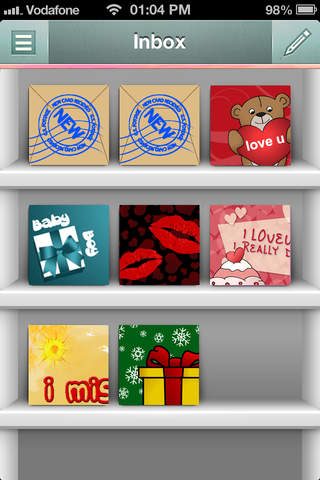

# Greetings Studio (2012 - 2014)

An iOS App for creating and sharing e-cards and visual sentiments [TayalT, Egypt].

## Roles / Duties

- Managed the product
- Served as the key cross-functional link between technical, business/marketing, UI/UX teams.
- Developed the architecture

## Achievements
- App rating on the Apple Store improved to 4 starts with many high user engagement and reviews.

<h1>
  
</h1>
