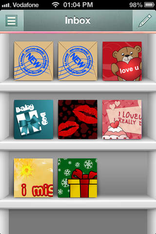

# Greetings Studio (2011 - 2014)

An iOS App for creating and sharing e-cards and visual sentiments [TayalT, Egypt].

## Roles / Duties

- Managed the product
- Led the technical team
- Developed the architecture

<h1>
  
</h1>

## Achievements
- App rating on the Apple Store improved to 4 starts with many high user engagement and reviews.