# The Basin Network Model

With the explosion of data storage formats/technologies/cloud providers and the sophistication of API technologies, there is no shortage of choices on where and how to store and process our data. However, an interesting gap arises once we take one level up the toolset-abstraction ladder and ask: once our teams grow, how can we effectively find data of interest within these oceans value? Furthermore, how can we do the same thing with the data of outside sources? 

One of the key lessons learned from the global COVID-19 situation is: we do not possess a mature technological landscape for end-to-end discovery and exchange of data across heterogeneous technical and social environments. Let’s call this the ‘inter-organizational data sharing and exchange’ problem. 

The challenge with many recent solutions is that they are built as 'platform-first.' This (1) leads to vendor lock-ins that stifle innovation and competition and (2) makes interoperability between vendors less attainable. Examples include the International Data Spaces (IDS) project. On the other hand, we have standards-first approaches which help orchestrate vendors in developing interoperable technologies. These approaches take us in the right direction but not too far. This is due to them being too high-level and more normative/prescriptive than constructive (what vs. how). This cluster includes proposals like the FAIR principles and W3C's Data on the Web Best Practices, or architectural abstractions such as data lake, data mesh, and data catalogue.

This work fills a gap by making a (1) 'medium-level' proposal, (2) in the form of a constructive recommendation, (3) which furthermore incorporates several of the major standards-first recommendations. We propose the *Basin Network*, a distributed data cataloguing architectural pattern. It revolves around two novel abstractions: the Offering, and the Basin. The Offering is a basic data cataloguing unit for some data of interest. The Basin is a system/node to author, catalogue, and manage Offerings and exchange them with other Basins, resulting in a Basin *Network* (akin to a network of data lakes). See figure below for a conceptual overview. 

We demonstrate the applicability of the proposal by applying it to three use-cases: (1) a computer-aided manufacturing project, (2) an IoT project in smart agriculture, and in (3) crowd data management. For more details, the full PhD thesis has been published online [here](https://fis.uni-bamberg.de/handle/uniba/91269).

<h1>
  
</h1>