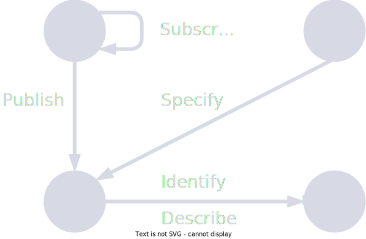

# The Basin Network Model

With the explosion of data storage formats/technologies/cloud providers and the sophistication of API technologies, theirs is no shortage of choices on where and how to store and process our data. However, an interesting gap arises once we take one level up the abstraction ladder and ask: once our teams grow in since and spread, how can we effectively find data of interest within these oceans of data? Furthermore, how can we do the same thing with data made available to us from outside sources? The global COVID-19 situation showed to us that we still do not have a mature technology landscape to facilitate end-to-end discovery and exchange of data across heterogeneous technical and social environments. Let’s call this the ‘inter-organizational data sharing and exchange’ problem. 

The challenge with many recent technologies is that they are built as 'platform-first' which (1) leads to vendor lock-ins that stifle innovation and competition and (2) makes interoperability between vendors less attainable. This includes efforts such as the International Data Spaces project and the Gaia-X Association, both in central Europe. On the other, we have standards-first approaches that help orchestrate vendors in developing interoperable technologies; taking us in the right direction but unfortunately not too far. This is due to them being too high-level and more normative/prescriptive than constructive. This cluster includes proposals like the FAIR principles, or architectural abstractions such as data lake, data mesh, and data catalog.

This work fills a gap by making a (1) 'medium-level' proposal, (2) in the form of a constructive recommendation (an architectural pattern), (3) which incorporates several of the major high-level recommendations at the same time. We propose the *Basin Network*, a distributed data cataloging architectural pattern. It revolves around two novel abstractions: the Offering, and the Basin. The Offering is a basic information cataloging unit for some data of interest. The Basin is a system/node to author, catalog, and manage Offerings and exchange them with other Basins, resulting in a Basin *Network* (akin to a network of data lakes). See figure below for a conceptual overview. 

We demonstrate the applicability of the proposal by applying it to three use-cases: (1) a computer-aided manufacturing project, (2) an IoT project in smart agriculture, and  in (3) crowd data management.

<h1>
  
</h1>