# The Basin Network - Sharing Data Across Organizational Boundaries

Storing and processing data has never offered more choice - formats, databases, cloud providers, APIs. The harder question sits one level up: once teams and partners multiply, **how do you find, describe, and safely exchange data across them** - not just inside your own systems, but across organizations that use different tools, follow different conventions, and answer to different legal and confidentiality constraints?

I call this the *inter-organizational data sharing and exchange* problem. My PhD (University of Bamberg, 2023) is an attempt to work it out from first principles - grounded in six years inside a multi-partner EU research consortium where it was a daily, unsolved reality, not a theoretical exercise.

## The gap

Most approaches sit at one of two extremes. **Platform-first** solutions (such as the International Data Spaces project) bundle the answer into one technology stack - which tends toward vendor lock-in and makes interoperability between vendors harder, not easier. **Standards-first** approaches - the FAIR principles, W3C's Data on the Web Best Practices, or architectural ideas like the data lake, data mesh, and data catalogue - point in the right direction but stay high-level and more prescriptive than constructive: strong on *what*, thin
on *how*. 

The Basin Network aims for the middle: a *constructive* architectural pattern with enough structure to build against, that also satisfies the major standards-first recommendations rather than competing with them.

## The idea

The pattern treats sharing as a matter of **describing and exchanging data, not moving or merging systems** - you publish a surrogate that stands in for a data asset, and the asset itself stays where it is. It rests on two pieces:

- **The Offering** - a self-contained descriptor for a data asset: how to access it, what it is, who's responsible for it, the terms it can be used under, and how it relates to other assets (lineage).
- **The Basin** - a node that authors, catalogues, and manages Offerings and exchanges them with other Basins by publish/subscribe, forming a *network* of catalogues with controlled visibility across organizational boundaries.

The same machinery works inside one team, across teams, and across companies - the only thing that changes is who can see what.

I tested the pattern against three real domains: collaborative aerospace/automotive manufacturing, IoT in smart agriculture, and crowd-sourced mobility data.

## A note on where this has gone

Since this work was completed, the industry has converged on much of the same ground from a different direction - the Open Data Contract and Data Product Standards (ODCS/ODPS), DCAT, and the dataspace initiatives now driven by Catena-X and the EU Data Act. I find that convergence
more validating than the original novelty: the field arrived, a few years later, at a similar shape. The enduring contribution of the thesis is less any single abstraction than the framing: _describe and govern data across boundaries without integrating the systems beneath it_.

The full thesis is published [here](https://fis.uni-bamberg.de/handle/uniba/91269).

<figure>
  
  <figcaption>The Basin Network in one picture: Basins publish Offerings and subscribe to one another to exchange them across boundaries.</figcaption>
</figure>