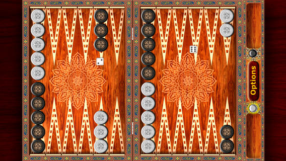

# Tawla (2011 - 2013)

Backgammon board game App on the iOS mobile platform. 

## Roles / Duties

- Developed 2 AI players (Hard level and & Medium Level)
- Developed complex random number generators for the dice algorithm.

## Achievements

- Throughout 2011-2013, the overall rating of the App steadily improved from 3 to 4+ stars on the Apple Store, with users citing the AI players as a key highlight.

<h1>
  
</h1>
