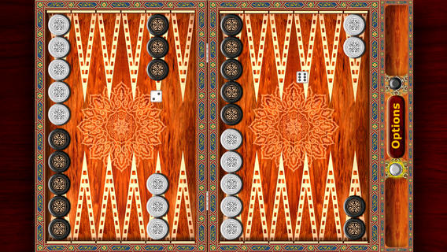

# Tawla (2011 - 2013)

Backgammon board game App on the iOS mobile platform. 

## Roles / Duties

- Led the technical team
- Developed AI players

## Achievements

- Throughout 2011-2013, the overall rating of the App steadily improved from 3 to 4 stars on the Apple Store, with users citing the usability/UI and the AI players as highlights.

<h1>
  
</h1>
